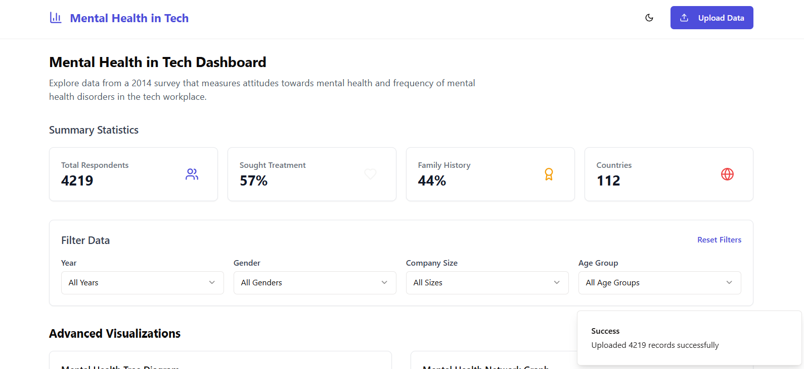

# Mental Health in Tech Data Visualization

A comprehensive data visualization web application that explores mental health trends and statistics in the tech industry.
<div style="display: flex; justify-content: center; align-items: center;">
  

</div>

## Features

- Interactive visualizations including:
  - Mental Health Tree Diagram
  - Network Graph Analysis
  - Geographic Distribution
  - Gender Distribution
  - Age Group Distribution
  - Company Size Analysis
  - Treatment Seeking Patterns
  - Family History Correlation
- Real-time filtering capabilities
- Responsive design
- Dark/Light theme support

## Tech Stack

- Frontend: React + TypeScript + Vite
- Data Visualization: D3.js
- Backend: Express.js
- Styling: Tailwind CSS
- UI Components: Radix UI

## Installation

1. Clone the repository
2. Install dependencies for both server and client:

```bash
# Install root project dependencies
npm install

# Install client dependencies
cd client
npm install
```

## Running the Application

From the root directory, run:

```bash
npm run dev
```

This will start both the server and client:
- Server runs on port 3000
- Frontend dev server with hot reloading

Access the application at: http://localhost:3000


The application visualizes mental health survey data with the following key attributes:
- Age Groups
- Gender Distribution
- Company Size
- Geographic Location
- Treatment History
- Family History
- Mental Health Diagnoses

## Visualization Types

1. **Tree Chart**: Hierarchical view of mental health factors
2. **Network Graph**: Relationship between various mental health aspects
3. **Geographic Distribution**: Location-based analysis
4. **Statistical Charts**: Demographics and trends analysis

## Filter Controls

Users can filter data by:
- Year
- Gender
- Company Size
- Age Group
